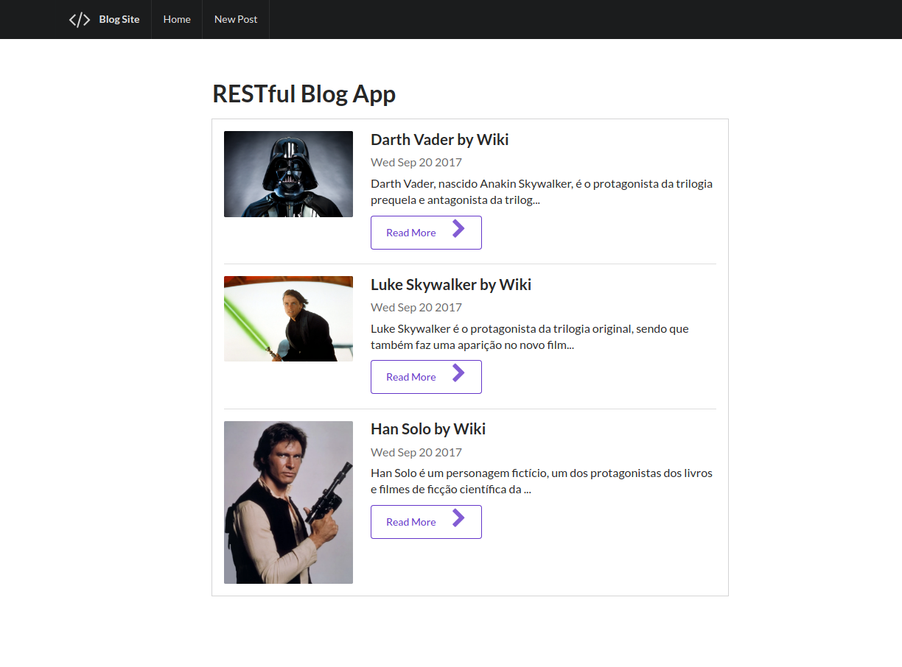
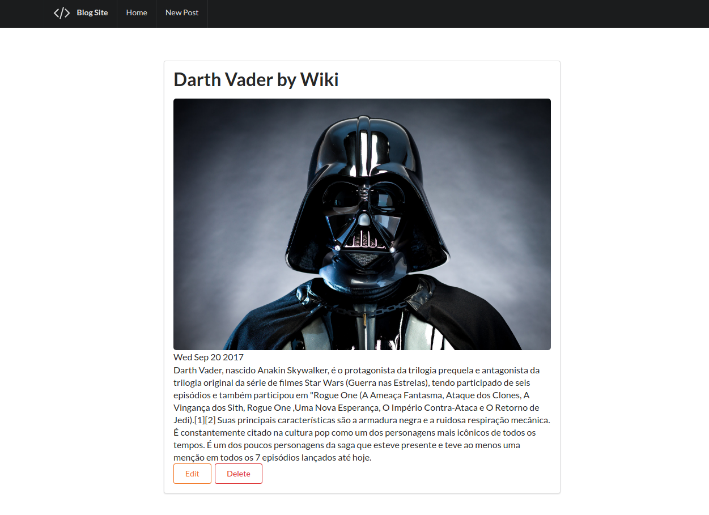
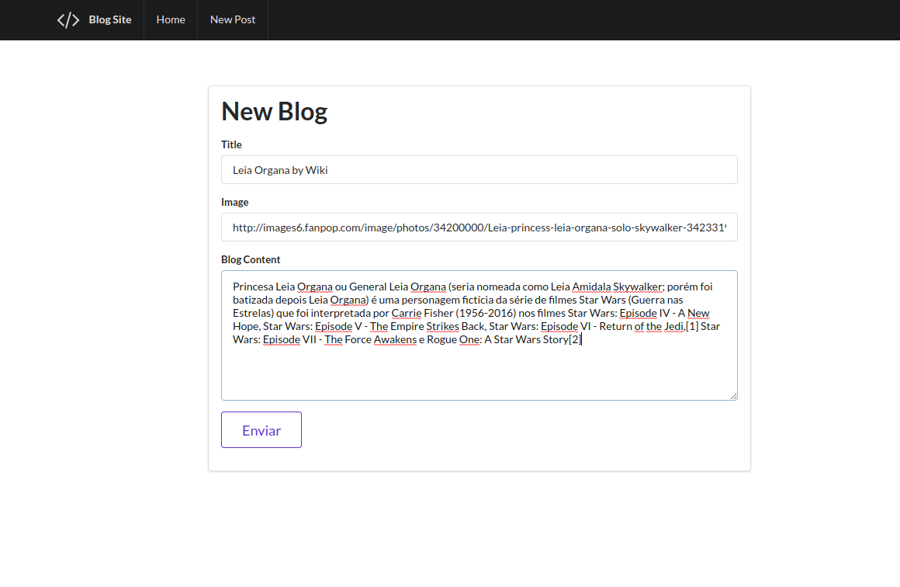
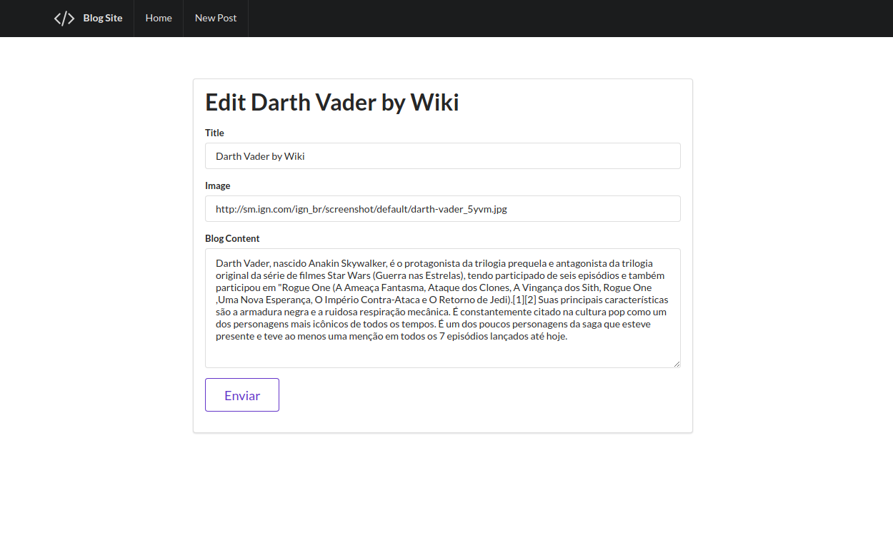

<h1> RESTful Blog. MongoDB + Express + Nodejs </h1>

<h3>package.json dependencies<h3>
<ul>
  <li>body-parser</li>
  <li>body-parser</li>
  <li>ejs</li>
  <li>express</li>
  <li>mongoose</li>
</ul>

